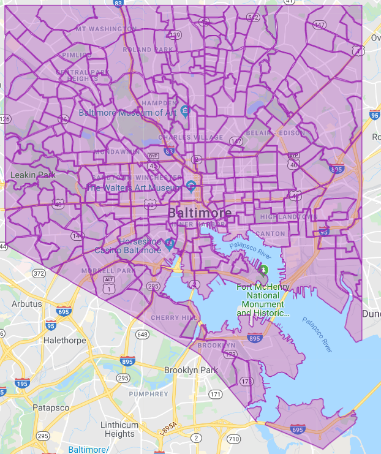

# Crime Data Analysis for Baltimore, MD

# Overview  

In this project I am working with data from the Baltimore Open Data website, which can be seen at this webpage; [https://data.baltimorecity.gov/Public-Safety/BPD-Part-1-Victim-Based-Crime-Data/wsfq-mvij](https://data.baltimorecity.gov/Public-Safety/BPD-Part-1-Victim-Based-Crime-Data/wsfq-mvij).  

I am trying to predict which areas and what times crimes are most likely to occur, in order to know where to deploy law enforcement to prevent them.

This is based on a report done which showed that on average, crimes that occur outside were reduced by about 15% when there was an increase of about 50% in the law enforcement on the streets.  
That report can be read in this PDF; [https://mason.gmu.edu/~atabarro/TerrorAlertProofs.pdf](https://mason.gmu.edu/~atabarro/TerrorAlertProofs.pdf)

### City of Baltimore, MD

I will be looking at crime by neighborhood in the city of Baltimore, MD, of which there are 278 neighborhoods.   

Map of Neighborhoods in Baltimore, MD

## Findings

With the data I had or was able to look up and find, I was unable to predict the area or time a crime would occur. I do believe that further work into this with more data about crime, may be able to get a good enough prediction to help deploy law enforcement to be able to reduce crimes that occur outside. Unfortunately, it was not something I was currently able to do with the data I had.  

## Recommendations

I would suggest getting better information on crime, possibly directly from the police, if they are willing to cooperate with such a study.  

## Future Work

1. Getting better data.  
2. Getting good enough prediction on area and time of crimes to be able to deploy law enforcement to be able to cause a reduction in crime just by their presence.
